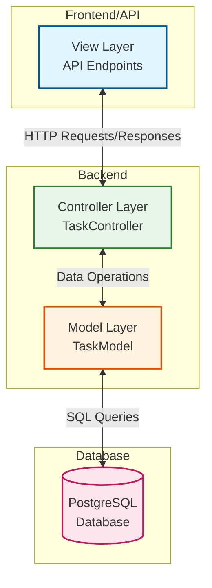

# Arquitetura MVC do Sistema de Gerenciamento de Tarefas

## Descrição dos Componentes

### View Layer

-   Representa a interface da API REST
-   Endpoints HTTP para interação com o sistema
-   Responsável por receber requisições e enviar respostas
-   Formata os dados para apresentação

### Controller Layer

-   Gerencia as requisições HTTP
-   Implementa a lógica de negócios
-   Coordena a comunicação entre View e Model
-   Valida dados de entrada
-   Processa respostas

### Model Layer

-   Implementa a lógica de acesso aos dados
-   Gerencia as operações do banco de dados
-   Define a estrutura dos dados
-   Implementa validações de dados

### Database

-   Armazena os dados persistentes
-   Tabelas principais:
    -   Users
    -   Tasks
    -   Categories
-   Relacionamentos entre entidades

## Fluxo de Dados

1. **Requisição HTTP** → View Layer
2. **Processamento** → Controller Layer
3. **Operações de Dados** → Model Layer
4. **Persistência** → Database
5. **Resposta** → View Layer → Cliente
