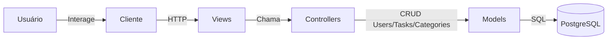

# Arquitetura MVC do Sistema de Gerenciamento de Tarefas

## Descrição dos Componentes

### Usuário e Cliente

-   **Usuário**: Pessoa que interage com o sistema via navegador ou ferramenta de API.
-   **Cliente**: Navegador ou ferramenta (ex: Postman) que faz requisições HTTP para o servidor.

### Servidor (Node.js/Express)

-   **Views**: Responsáveis por formatar e entregar as respostas da API.
-   **Controllers**: Implementam a lógica de negócio, recebem requisições, validam dados e coordenam as operações.
-   **Models**: Representam as entidades do banco de dados e executam operações SQL.

### Banco de Dados

-   **PostgreSQL**: Armazena dados persistentes das entidades (Users, Tasks, Categories).

## Fluxo de Dados

1. Usuário interage com o Cliente (navegador ou ferramenta de API).
2. Cliente faz requisições HTTP para o Servidor.
3. Views recebem as requisições e encaminham para os Controllers.
4. Controllers processam a lógica e interagem com os Models.
5. Models executam operações no Banco de Dados.
6. Respostas são devolvidas ao Cliente e apresentadas ao Usuário.
