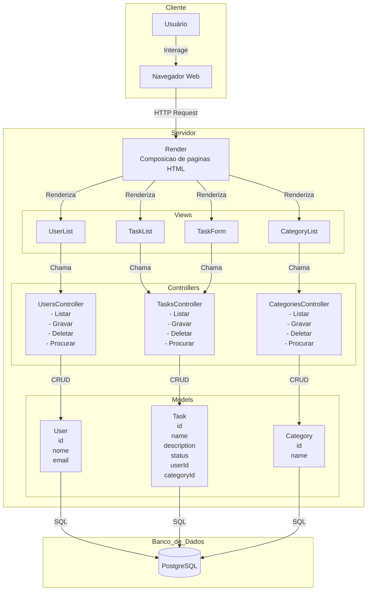

# Arquitetura MVC do Sistema de Gerenciamento de Tarefas

## Descrição dos Componentes

### Cliente

-   **Usuário**: Pessoa que interage com o sistema via navegador ou ferramenta de API.
-   **Navegador Web**: Interface HTTP para o usuário.

### Servidor (Node.js/Express)

-   **Render**: Responsável por compor e devolver as páginas HTML (ou respostas da API).
-   **Views**: Componentes de apresentação (TaskList, TaskForm, UserList, CategoryList).
-   **Controllers**: Implementam a lógica de negócio, recebem requisições, validam dados e coordenam as operações (UsersController, TasksController, CategoriesController).
-   **Models**: Representam as entidades do banco de dados e executam operações SQL (User, Task, Category).

### Banco de Dados

-   **PostgreSQL**: Armazena dados persistentes das entidades (Users, Tasks, Categories).

## Fluxo de Dados

1. Usuário interage com o Navegador Web.
2. Navegador faz requisições HTTP para o Servidor.
3. Render compõe a resposta e aciona as Views.
4. Views acionam os Controllers conforme a ação.
5. Controllers processam a lógica e interagem com os Models.
6. Models executam operações no Banco de Dados.
7. Respostas são devolvidas ao Navegador e apresentadas ao Usuário.
