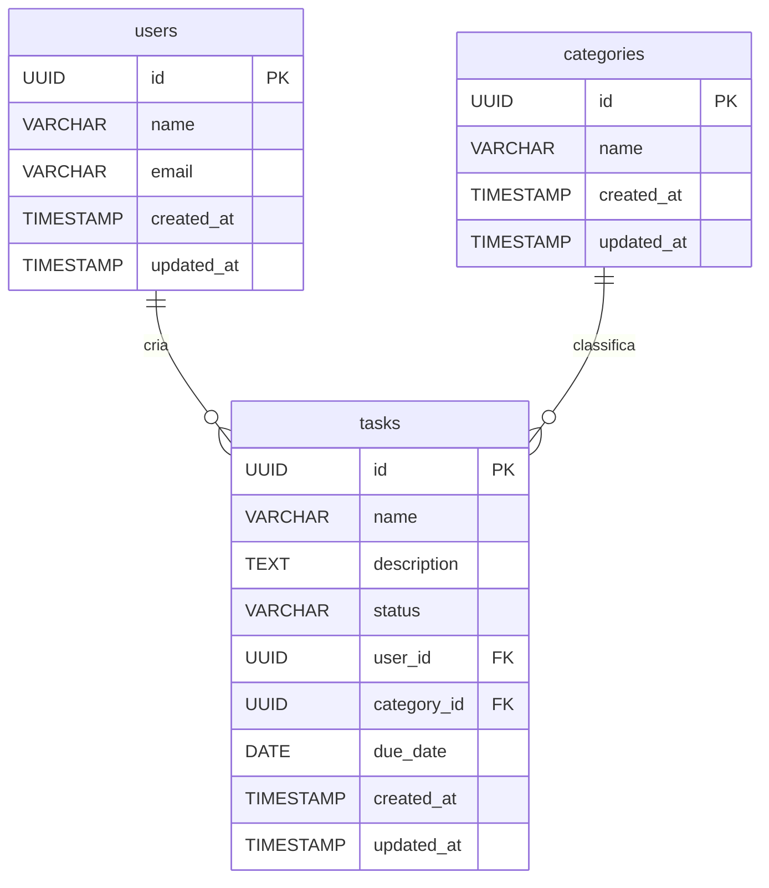

# Web Application Document - Projeto Individual - Módulo 2 - Inteli

## Introdução

O **Gerenciador de Tarefas** é uma aplicação web full-stack que permite criar, organizar e acompanhar atividades, oferecendo tanto uma **API REST** quanto páginas web renderizadas no servidor.  
Desde a última iteração o sistema recebeu melhorias de experiência de usuário (novo layout responsivo, cabeçalho animado e seção *hero* com vídeo) e ajustes de nomenclatura no banco de dados.

> Versão do documento: **2024-06-08**

### Objetivo do Sistema

O Gerenciador de Tarefas é uma aplicação web que permite aos usuários gerenciar suas tarefas de forma eficiente. O sistema oferece funcionalidades para criar, visualizar, atualizar e excluir tarefas, além de organizá-las em categorias e atribuir prazos.

### Tecnologias Principais

- Backend : Node.js + Express  
- Banco de Dados : PostgreSQL  
- Visualização : EJS + CSS vanilla
- Testes : Jest + Supertest

### Funcionalidades Principais

1. Gerenciamento de Usuários

    - Cadastro e autenticação de usuários
    - Perfil de usuário

2. Gerenciamento de Tarefas

    - Criação de tarefas com título, descrição e prazo
    - Atualização de status (pendente, em andamento, concluída)
    - Organização por categorias
    - Filtros e busca

3. Gerenciamento de Categorias
    - Criação e personalização de categorias
    - Organização de tarefas por categoria

## Referência de Arquitetura

Para uma visão detalhada da arquitetura do sistema, consulte o diagrama atualizado no arquivo [`documents/architecture.md`](architecture.md). O diagrama apresenta a separação entre Cliente, Servidor (Render, Views, Controllers, Models) e Banco de Dados, com todos os fluxos, entidades e métodos principais do projeto.

## Diagrama do Banco de Dados

O sistema utiliza um banco de dados PostgreSQL com as seguintes tabelas principais:

### Estrutura do Banco de Dados



### Relacionamentos

1. **Users - Tasks**: Um usuário pode ter múltiplas tarefas (1:N)
2. **Categories - Tasks**: Uma categoria pode ter múltiplas tarefas (1:N)

### Scripts de Criação

-- função para atualizar updated_at
create or replace function set_updated_at() returns trigger as $$
begin
new.updated_at = now();
return new;
end;

$$
language plpgsql;

-- tabela users
CREATE TABLE IF NOT EXISTS users (
  id          UUID PRIMARY KEY DEFAULT uuid_generate_v4(),
  name        VARCHAR(255) NOT NULL,
  email       VARCHAR(255) NOT NULL UNIQUE,
  created_at  TIMESTAMPTZ NOT NULL DEFAULT now(),
  updated_at  TIMESTAMPTZ NOT NULL DEFAULT now()
);
CREATE TRIGGER trg_users_updated_at
  BEFORE UPDATE ON users
  FOR EACH ROW EXECUTE PROCEDURE set_updated_at();

-- tabela categories
CREATE TABLE IF NOT EXISTS categories (
  id          UUID PRIMARY KEY DEFAULT uuid_generate_v4(),
  name        VARCHAR(255) NOT NULL,
  created_at  TIMESTAMPTZ NOT NULL DEFAULT now(),
  updated_at  TIMESTAMPTZ NOT NULL DEFAULT now()
);
CREATE TRIGGER trg_categories_updated_at
  BEFORE UPDATE ON categories
  FOR EACH ROW EXECUTE PROCEDURE set_updated_at();

-- tabela tasks
CREATE TABLE IF NOT EXISTS tasks (
  id          UUID PRIMARY KEY DEFAULT uuid_generate_v4(),
  name        VARCHAR(255) NOT NULL,
  description TEXT NOT NULL,
  status      VARCHAR(255) NOT NULL,
  user_id     UUID NOT NULL REFERENCES users(id) ON DELETE CASCADE,
  category_id UUID NOT NULL REFERENCES categories(id) ON DELETE SET NULL,
  due_date    DATE NOT NULL,
  created_at  TIMESTAMPTZ NOT NULL DEFAULT now(),
  updated_at  TIMESTAMPTZ NOT NULL DEFAULT now()
);
CREATE TRIGGER trg_tasks_updated_at
  BEFORE UPDATE ON tasks
  FOR EACH ROW EXECUTE PROCEDURE set_updated_at();

## API Routes

O sistema implementa uma API RESTful com os seguintes endpoints:

### Usuários (Users)

- **POST /api/users**
  - Cria um novo usuário
  - Body:
    ```json
    {
      "name": "Nome do Usuário",
      "email": "email@exemplo.com"
    }
    ```
  - Retorna: Usuário criado com ID

- **GET /api/users**
  - Lista todos os usuários
  - Retorna: Array de usuários

- **GET /api/users/:id**
  - Busca um usuário específico
  - Parâmetros: ID do usuário
  - Retorna: Dados do usuário

- **PUT /api/users/:id**
  - Atualiza dados de um usuário
  - Parâmetros: ID do usuário
  - Body: Dados a serem atualizados
  - Retorna: Usuário atualizado

### Tarefas (Tasks)

- **POST /api/tasks**
  - Cria uma nova tarefa
  - Body:
    ```json
    {
      "name": "Título da tarefa",
      "description": "Descrição da tarefa",
      "status": "pending",
      "user_id": "uuid-do-usuario",
      "category_id": "uuid-da-categoria",
      "due_date": "2024-03-20"
    }
    ```
  - Retorna: Tarefa criada com ID

- **GET /api/tasks**
  - Lista todas as tarefas
  - Query Parameters:
    - `status`: Filtra por status (pending, in_progress, completed)
    - `category_id`: Filtra por categoria
    - `user_id`: Filtra por usuário
  - Retorna: Array de tarefas

- **GET /api/tasks/:id**
  - Busca uma tarefa específica
  - Parâmetros: ID da tarefa
  - Retorna: Dados da tarefa

- **PUT /api/tasks/:id**
  - Atualiza uma tarefa
  - Parâmetros: ID da tarefa
  - Body: Dados a serem atualizados
  - Retorna: Tarefa atualizada

- **DELETE /api/tasks/:id**
  - Remove uma tarefa
  - Parâmetros: ID da tarefa
  - Retorna: Status da operação

- **GET /api/users/:userId/tasks**
  - Lista todas as tarefas de um usuário específico
  - Parâmetros: ID do usuário
  - Query Parameters:
    - `status`: Filtra por status
    - `category_id`: Filtra por categoria
  - Retorna: Array de tarefas do usuário

### Categorias (Categories)

- **POST /api/categories**
  - Cria uma nova categoria
  - Body:
    ```json
    {
      "name": "Nome da Categoria"
    }
    ```
  - Retorna: Categoria criada com ID

- **GET /api/categories**
  - Lista todas as categorias
  - Retorna: Array de categorias

- **GET /api/categories/:id**
  - Busca uma categoria específica
  - Parâmetros: ID da categoria
  - Retorna: Dados da categoria

- **PUT /api/categories/:id**
  - Atualiza uma categoria
  - Parâmetros: ID da categoria
  - Body: Dados a serem atualizados
  - Retorna: Categoria atualizada

- **DELETE /api/categories/:id**
  - Remove uma categoria
  - Parâmetros: ID da categoria
  - Retorna: Status da operação

### Respostas da API

Todas as respostas da API seguem o seguinte formato:

```json
{
  "success": true/false,
  "data": {}, // Dados da resposta (objeto ou array)
  "error": null // Mensagem de erro, se houver
}
```

### Códigos de Status HTTP

- 200: Sucesso
- 201: Recurso criado
- 400: Requisição inválida
- 404: Recurso não encontrado
- 500: Erro interno do servidor

## 📚 Aprendizados & Desafios

| Desafio | Solução Aplicada |
|---------|------------------|
| **Trazer feedback em tempo real** para o usuário ao alterar status de tarefas | Utilizado **Fetch API** com `fetch('/api/tasks/:id', { method: 'PUT' })` e atualização otimista do DOM para evitar recarregar a página |
| **Validação de entradas** tanto no cliente quanto no servidor | Criados middlewares de validação (Joi) no backend e constraints HTML5 no frontend, assegurando mensagens claras de erro |


### Pontos que funcionaram bem

* Estrutura **MVC** clara facilitando manutenção.
* Separação de camadas permitiu trocar *views* sem impactar rotas.
* Cobertura de testes reduziu regressões durante refactors.

### Pontos a melhorar futuramente

* Adicionar WebSockets para atualização em tempo real entre usuários.
* Criar layout com componente design system (ex.: Tailwind ou Bootstrap 5).

---

_Última atualização: 2024-06-13_
