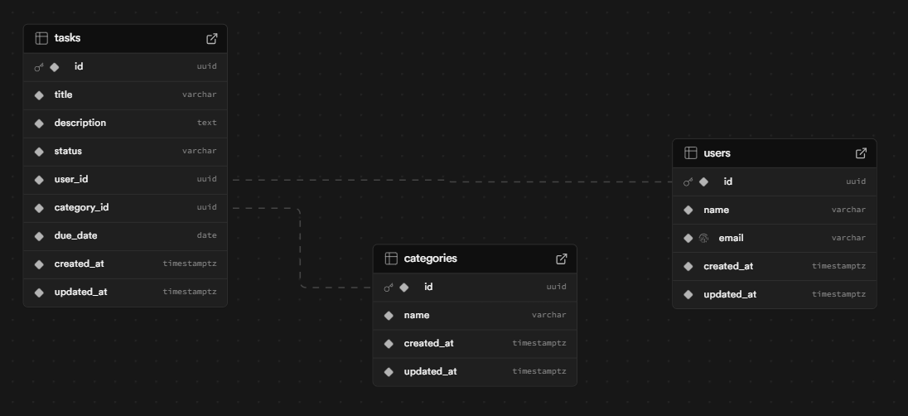

# Web Application Document - Projeto Individual - Módulo 2 - Inteli

Estou fazendo a opção 1, gerenciador de tarefas.

### Modelagem do banco de dados  (Semana 3)



```
-- função para atualizar updated_at
create or replace function set_updated_at() returns trigger as $$
begin
  new.updated_at = now();
  return new;
end;
$$ language plpgsql;

-- tabela users
CREATE TABLE IF NOT EXISTS users (
  id          UUID PRIMARY KEY DEFAULT uuid_generate_v4(),
  name        VARCHAR(255) NOT NULL,
  email       VARCHAR(255) NOT NULL UNIQUE,
  created_at  TIMESTAMPTZ NOT NULL DEFAULT now(),
  updated_at  TIMESTAMPTZ NOT NULL DEFAULT now()
);
CREATE TRIGGER trg_users_updated_at
  BEFORE UPDATE ON users
  FOR EACH ROW EXECUTE PROCEDURE set_updated_at();

-- tabela categories
CREATE TABLE IF NOT EXISTS categories (
  id          UUID PRIMARY KEY DEFAULT uuid_generate_v4(),
  name        VARCHAR(255) NOT NULL,
  created_at  TIMESTAMPTZ NOT NULL DEFAULT now(),
  updated_at  TIMESTAMPTZ NOT NULL DEFAULT now()
);
CREATE TRIGGER trg_categories_updated_at
  BEFORE UPDATE ON categories
  FOR EACH ROW EXECUTE PROCEDURE set_updated_at();

-- tabela tasks
CREATE TABLE IF NOT EXISTS tasks (
  id          UUID PRIMARY KEY DEFAULT uuid_generate_v4(),
  title       VARCHAR(255) NOT NULL,
  description TEXT NOT NULL,
  status      VARCHAR(255) NOT NULL,
  user_id     UUID NOT NULL REFERENCES users(id) ON DELETE CASCADE,
  category_id UUID NOT NULL REFERENCES categories(id) ON DELETE SET NULL,
  due_date    DATE NOT NULL,
  created_at  TIMESTAMPTZ NOT NULL DEFAULT now(),
  updated_at  TIMESTAMPTZ NOT NULL DEFAULT now()
);
CREATE TRIGGER trg_tasks_updated_at
  BEFORE UPDATE ON tasks
  FOR EACH ROW EXECUTE PROCEDURE set_updated_at();

```
