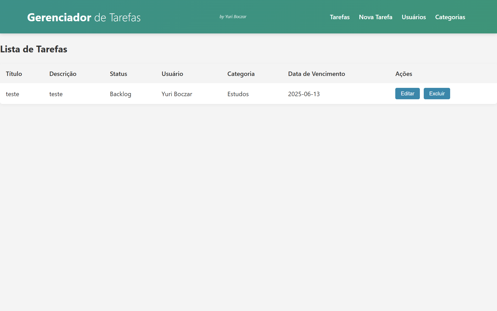
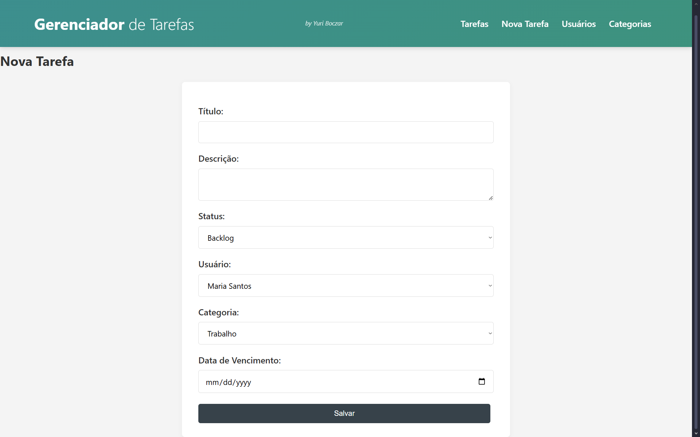
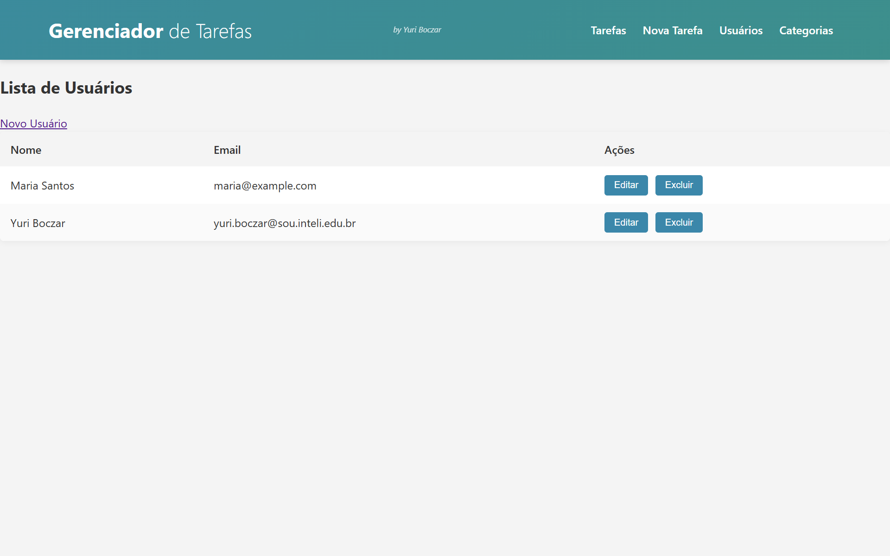
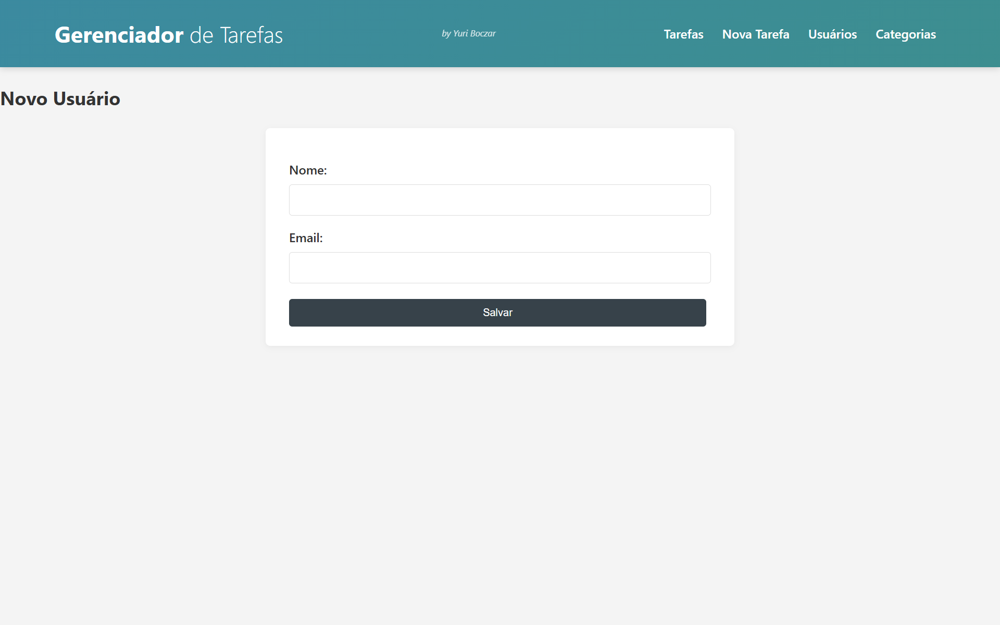
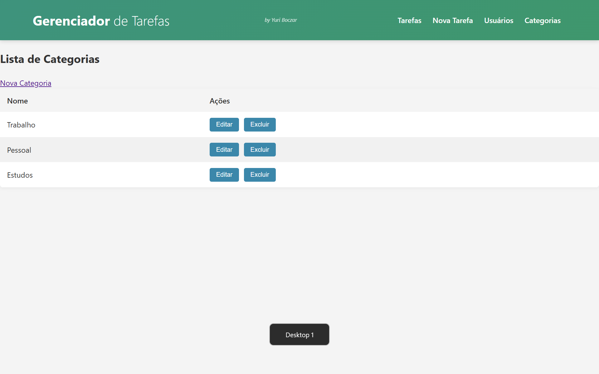
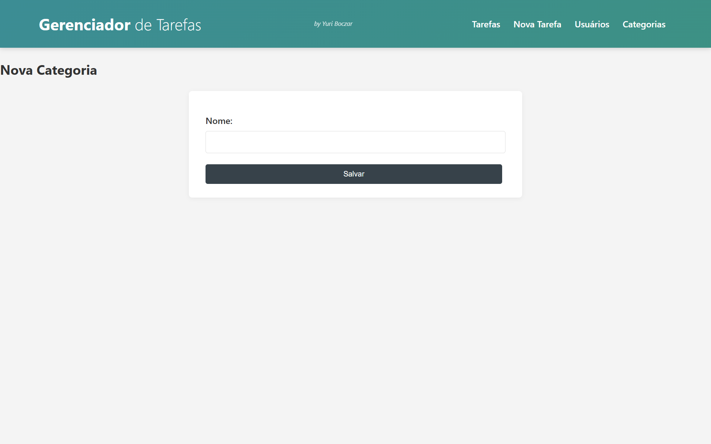

# Gerenciador de Tarefas

Um aplicativo web completo para organização de tarefas desenvolvido como projeto individual do **Módulo&nbsp;2 – Ciência da Computação (Inteli)**. O sistema segue a arquitetura **MVC**, utiliza **Node.js + Express** no backend, **EJS** para server-side rendering e **PostgreSQL** para persistência dos dados.  
Com ele é possível:

* Cadastrar usuários, categorias e tarefas;
* Definir prazos, status e responsáveis;
* Filtrar, editar ou excluir registros;
* Acessar as funcionalidades via páginas web ou API REST.

---

## 🗂️ Estrutura de pastas (src-tree)

```text
.
├── assets/              # Arquivos estáticos (CSS, imagens, vídeos)
│   └── style.css
├── config/              # Configurações (conexão ao BD)
│   └── database.js
├── controllers/         # Lógica de negócio / middlewares Express
│   ├── CategoryController.js
│   ├── TaskController.js
│   └── UserController.js
├── documents/           # Documentação complementar (WAD, ER, arquitetura)
│   ├── architecture.md
│   ├── tables.md
│   └── wad.md
├── models/              # Camada de acesso a dados
│   ├── CategoryModel.js
│   ├── TaskModel.js
│   └── UserModel.js
├── routes/              # Rotas agrupadas da API e rotas de páginas
│   ├── frontRoutes.js
│   └── index.js
├── services/            # Serviços auxiliares (ex.: envio de e-mail)
├── views/               # Templates EJS (layout, pages)
│   ├── layout/
│   │   └── main.ejs
│   └── pages/
├── scripts/             # Scripts de inicialização ou manutenção
│   └── init.sql
├── tests/               # Casos de teste (Jest + Supertest)
├── server.js            # Ponto de entrada da aplicação
├── package.json         # Dependências e scripts npm
└── .env.example         # Exemplo de variáveis de ambiente
```

---

## 🚀 Executando o projeto localmente

1. **Clone o repositório**

   ```bash
   git clone https://github.com/B0czar/PM2-YuriBoczar.git
   cd PM2-YuriBoczar
   ```

2. **Instale as dependências**

   ```bash
   npm install  # ou yarn
   ```

3. **Configure as variáveis de ambiente**  
   Renomeie `.env.example` para `.env` e ajuste as credenciais do banco:

   ```env
   DB_HOST=localhost
   DB_PORT=5432
   DB_USER=seu_usuario
   DB_PASSWORD=sua_senha
   DB_DATABASE=gerenciador_tarefas
   PORT=3000
   ```

4. **Crie o banco e as tabelas**

   PgAdmin ou psql:
   ```sql
   CREATE DATABASE gerenciador_tarefas;
   \c gerenciador_tarefas
   \i scripts/init.sql -- ou copie/cole o conteúdo
   ```

5. **Inicie o servidor**

   ```bash
   npm start
   # Acesse http://localhost:3000
   ```

---

## 📄 Documentação adicional

| Documento | Descrição |
|-----------|-----------|
| [Web Application Document](documents/wad.md) | Requisitos, diagramas e referências da API |
| [Arquitetura](documents/architecture.md) | Diagrama de componentes (MVC) |
| [Tabelas do Banco](documents/tables.md) | Script SQL das tabelas |

## 📁 Arquivos principais

| Arquivo | Descrição |
|---------|-----------|
| [Configuração do Banco](config/database.js) | Configuração da conexão com PostgreSQL |
| [Modelo de Tarefas](models/TaskModel.js) | Definição e operações com tarefas |
| [Modelo de Usuários](models/UserModel.js) | Definição e operações com usuários |
| [Modelo de Categorias](models/CategoryModel.js) | Definição e operações com categorias |
| [Controlador de Tarefas](controllers/TaskController.js) | Lógica de negócio para tarefas |
| [Rotas Frontend](routes/frontRoutes.js) | Rotas das páginas web |
| [Rotas API](routes/index.js) | Rotas da API REST |
| [Layout Principal](views/layout/main.ejs) | Template base da aplicação |
| [Estilos](assets/style.css) | Estilos CSS da aplicação |
| [Script de Inicialização](scripts/init.sql) | Script SQL para criar o banco de dados |

---

## 🎬 Demonstração em Vídeo

Assista ao funcionamento completo da aplicação (backend + frontend) em menos de **5&nbsp;minutos**:
[](https://drive.google.com/file/d/1gwfaibFoDVNUwUEAnFNbnhvvUOx3UPqg/view?usp=drive_link)

> Clique na imagem acima para assistir ao vídeo de demonstração no Google Drive.
---

## 📸 Capturas de Tela

| Tela | Descrição |
|------|-----------|
|  | Página inicial com listagem e status das tarefas |
|  | Formulário para criação de uma nova Tarefa  |
|  | Página de usuários |
|  |  Formulário para criação de um novo usuário |
|  |  Página de categorias |
|  |  Formulário para criação de uma nova categoria  |
---

## 🛠️ Tecnologias Utilizadas

| Camada | Tecnologias |
|--------|-------------|
| Backend | Node.js 20 · Express 4 |
| Frontend (SSR) | EJS · HTML5 · CSS&nbsp;Vanilla |
| Banco de Dados | PostgreSQL 16 |

